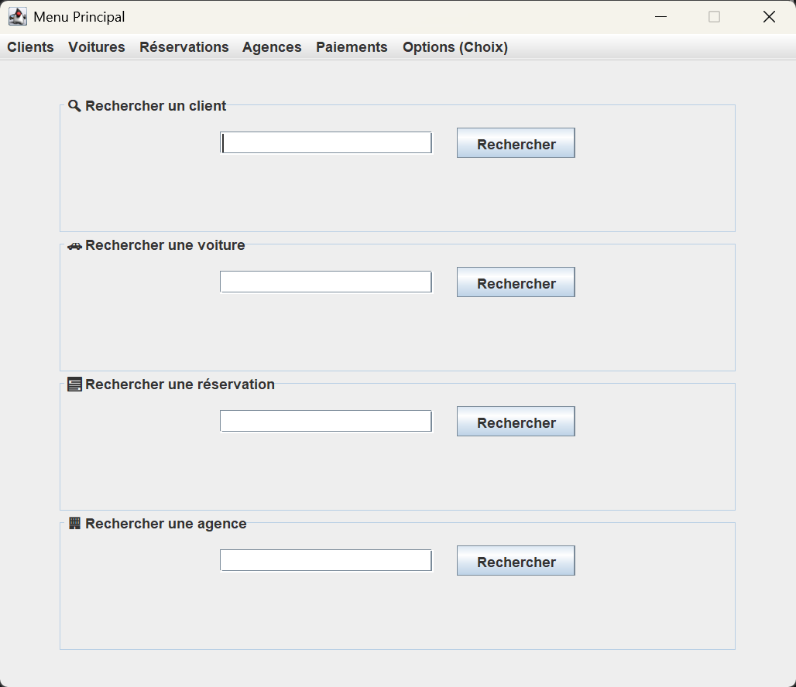

# 🚗 Système de Réservation de Voitures

Projet de session réalisé dans le cadre du cours de bases de données relationnelles à l'UQAC.

## 📌 Description

Ce projet consiste à développer une application de bureau en Java Swing connectée à une base de données MySQL, permettant de gérer un système complet de réservation de voitures. Le système prend en charge la gestion des clients, des voitures, des agences, des paiements et des options personnalisées (ex. GPS, siège bébé, etc.).

## ✨ Fonctionnalités principales

- Ajout, modification et suppression :
  - des clients
  - des voitures
  - des agences
  - des réservations
  - des paiements
  - des choix d’options
- Filtres dynamiques : recherche par nom, date, statut, prix
- Calcul automatique du prix total d'une réservation (voiture + options)
- Vérification de disponibilité (conflits de dates)
- Transactions sécurisées (`setAutoCommit(false)`, `commit()`, `rollback()`)

## 🧱 Technologies utilisées

- **Java** (Java Swing)
- **MySQL** (MySQL Workbench pour la modélisation et la base de données)
- **JDBC** pour la connexion Java-MySQL
- **JDatePicker** pour la sélection de dates

## 🖥️ Captures d'écran

## ⚙️ Installation

### Prérequis

- Java JDK 8 ou supérieur
- MySQL Server
- IDE Java (ex: Eclipse,...)

